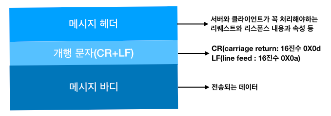

# 3. HTTP정보는 HTTP메세지에 있다.

## 1. HTTP 메세지

HTTP에서 교환하는 정보는 HTTP 메세지라고 불립니다.  HTTP 메시지는 복수 행(개행 문자는 CR+RF)의 데이터로 구성된 텍스트 문자열입니다. HTTP 메시지는 크게 구분하면 메시지 헤더와 메시지 바디로 구성되어 있고, 최초에 나타나는 개행 문자(CR+LF)로 메시지 헤더와 메시지 바디를 구분합니다. 이 안에 항상 메시지 바디가 존재한다고는 할 수 없습니다.



## 2. 리퀘스트 메시지와 리스폰스 메시지의 구조


리퀘스트 메시지와 리스폰스 메시지의 헤더 내부는 다음과 같은 데이터로 구성되어 있습니다.

- 리퀘스트 라인: 리퀘스트에 사용하는 메소드와 리퀘스트 URI와 사용하는 HTTP 버젼이 포함됩니다.
- 상태라인: 리스폰스 결과를 나타내는 상태 코드와, 사용하는 HTTP 버전이 포함됩니다.
- 헤더 필드: 리퀘스트와 리스폰스의 여러 조건과 속성 등을 나타내는 각종 헤더 필드가 포함됩니다. 일반 헤더 필드, 리퀘스트 헤더 필드, 리스폰스 헤더 필드, 엔티티 헤더 필드 등 4종류가 있습니다.

그 외에는 HTTP의 RFC에 없는 헤드 필드(쿠키 등)가 포함되어 있는 경우가 있습니다.

## 3. 인코딩으로 전송 효율을 높이다.

HTTP로 데이터를 전송할 경우 그대로 전송할 수도 있지만 전송할 때에 인코딩(변환)을 실시함으로써 전송 효율을 높일 수 있습니다. 

전송할 때 인코딩을 하면 다량의 액세스를 효율 좋게 처리할 수 있습니다. 단지, 컴퓨터에서 인코딩 처리를 해야 하기 때문에 CPU 등의 리소스를 보다 많이 소비하게 됩니다.

### 메시지 바디와 엔티티 바디의 차이

- 메시지(message): HTTP 통신의 기본 단위로 옥텟 시퀸스(Octet sequence, octet은 8비트)로 구성되고 통신을 통해서 전송됩니다.
- 엔티티(entity): 리퀘스트랑 리스폰스의 페이로드(payload)로 전송되는 정보로 엔티티 헤더 필드와 엔티티 바디로 구성됩니다.

HTTP 메시지 바디의 역할은 리퀘스트랑 리스폰스에 관한 엔티티 바디를 운반하는 일입니다. 기본적으로 메시지 바디와 엔티티 바디는 같지만 전송 코딩이 적용된 경우에는 엔티티 바디의 내용이 변화하기 때문에 메시지 바디와 달라집니다.

### 압축해서 보내는 콘텐츠 코딩

콘텐츠 코딩은 엔티티에 적용되는 인코딩을 가리키는데 엔티티 정보를 유지한채로 압축합니다. 콘텐츠 코딩된 엔티티는 수신한 클아이언트 측에서 디코딩 합니다. 주요 콘텐츠 압축에는 다음과 같은 것이 있습니다.

- gzip(GNU zip)
- compress(UNIX의 표준 압축)
- deflate(zlib)
- identity(인코딩 없음)

### 분해해서 보내는 청크 전송 코딩

HTTP 통신에서는 리퀘스트 했었던 리소스 전부에서 엔티티 바디의 전송이 완료되지 않으면 브라우저에 표시되지 않습니다. 사이즈가 큰 데이터를 전송하는 경우에 데이터를 분할해서 조금씩 표시할 수 있습니다.

이렇게 엔티티 바디를 분할하는 기능을 청크 전송 코딩(Chunked transfer Coding)이라고 부릅니다.

청크 전송 코딩은 엔티티 바디를 청크(덩어리)로 분해합니다. 다음 청크 사이즈를 16진수로 사용해서 단락을 표시하고 엔티티 바디 끝에는 "0(CR+LF)"를 기록해 둡니다.

청크 전송 코딩된 엔티티 바디는 수신한 클라이언트 측에서 원래의 엔티티 바디로 디코딩 합니다. 

## 4. 여러 데이터를 보내는 멀티 파트

메일의 경우에는 메일의 본문이나 복수의 첨부 파일을 붙여서 함께 보낼 수 있습니다. 이것은 MIME(Multipurpose Internet Mail Extensions: 다목적 인터넷 메일 확장 사양)으로 불리는 메일로 텍스트나, 영상 이미지와 같은 여러 다른 데이터를 다루기 위한 기능을 사용하고 있습니다.

MIME은 이미지 등의 바이너리 데이터를 아스키(ASCII) 문자열에 인코딩하는 방법과 데이터 종류를 나타내는 방법 등을 규정하고 있습니다. 이 MIME의 확장 사양에 있는 멀티파트라고 하는 여러 다른 종류의 데이터를 수용하는 방법이 있고 사용되고 있습니다.

HTTP도 멀티파트에 대응하고 있어 하나의 메시지 바디 내부에 엔티티를 여러 개 포함시켜 보낼 수 있습니다. 주로 이미지나 텍스트 파일 등을 업로드할 때 사용되고 있습니다.

- multipart/form-data: Web 폼으로부터 파일 업로드에 사용됩니다.
- multipart/byteranges: 상태코드206(Partial Content) 리스폰스 메시지가 복수 범위의 내용을 포함하는 때에 사용됩니다.

HTTP 메시지로 멀티파트를 사용할 때에서 Content-type 헤더 필드를 사용합니다.

멀티파트 각각의 엔티티를 구분하기 위해 "boundary" 문자열을 사용합니다. 각 엔티티의 선두에는 "boundary" 문자열 앞에 "--"를 삽입합니다. 멀티파트의 마지막에는 그 문자열의 마지막 부분에 "--"를 삽입해서 마무리합니다.

```http
Content-Type: multipart/form-data; boundary=AaB03x
--AaBo3x
Content-disposition: form-data; name="field1"

Joe Blow
--AaB03x
Content-Disposition: form-data; name="pics"; filename="file1.txt"
Content-Type:text/plain

...(file1.txt데이터)...
--AaB03x--
```

멀티파트는 파트마다 헤더 필드가 포함됩니다. 또한 파트의 중간에 멀티파트를 만드는 거소가 같이 파트를 내부에 포함할 수도 있습니다.

## 5. 일부분만 받는 레인지 리퀘스트

요즘처럼 사용자가 광대역의 네트워크를 이용할 수 있기 전에는 대용량의 이미지와 데이터를 다운로드하기가 힘들었습니다. 왜냐하면 다운로드 중에 커넥션이 끊어지게 되면 청므부터 다시 다운로드를 해야 했기 때문입니다. 이러한 문제를 해결하기 위해서 일반적인 리줌(resume)이라는 기능이 필요하게 되었습니다. 리줌을 통해 이전에 다운로드를 한 곳에서 부터 다운로드를 재개할 수 있습니다. 

이 기능을 실현하기 위해서는 엔티티의 범위를 지정해서 다운로드를 할 필요가 있습니다. 이와 같이 범위를 지정하여 리퀘스트 하는 것을 레인지 리퀘스트(Range Request)라고 부릅니다.

레인지 리퀘스트를 사용하면 전체 10,000 바이트 정도 크기의 리소스에서 5,001~10,000 바이트 범위(바이트 레인지)만을 리퀘스트 할 수 있습니다. 레인지 리퀘스트를 할 때에는 Range 헤더 필드를 사용해서 리소스의 바이트 레인지를 지정합니다.

```http
Range: bytes= 5001-10000
```

레인지 리퀘스트에 대한 리스폰스 상태 코드 206 Partial Content 라는 리스폰스 메시지가 되돌아옵니다. 또한, 복수 범위의 레인지 리퀘스트에 대한 리스폰스는 multipart/byterages로 리스폰스가 되돌아 옵니다.

서버가 레인지 리퀘스트에 지원하지 않는 경우에는 상태코드 200 OK 라는 리스폰스 메시지로 완전한 엔티티가 되돌아옵니다.

## 6. 최적의 콘텐츠를 돌려주는 콘텐츠 네고시에이션

같은 내용이지만 여러 개의 페이지를 지닌 웹페이지가 있습니다. 언어가 다른 경우가 하나의 케이스가 되겠죠. 이러한 웹 페이지에서 브라우저는 같은 URI에 엑세스할 때에 각각 영어판 웹페이지와 한국어판 웹 페이지를 표시합니다. 이러한 구조를 콘텐츠 네고시에이션(Content Nagotiation)이라고 부릅니다. 

콘텐츠 네고시시에이션이란 클라이언트와 서버가 제공하는 리소스의 내용에 대해서 교섭하는 것입니다. 콘텐츠 네고시에이션은 제공하는 리소스를 언어와 문자 세트, 인코딩 방식등을 기준으로 판단하고 있습니다.

판단 기준은 리퀘스트 메시지에 포함된 다음과 같은 리퀘스트 헤더 필드입니다. 

- Accept
- Accept-Charset
- Accept-Encoding
- Accept-Language
- Content-Language

### 서버 구동형 네고시에이션(Server-driven Negotitation)

서버 측에서 콘텐츠 네고시에이션을 하는 방식입니다. 서버 측에서 리퀘스트 헤더 필드의 정보를 참고해서 자동적으로 처리합니다.

단지, 브라우저가 보내는 정보를 근거로 하기 때문에 유저에게 정말로 적절한 것이 선택되었다고 할 수 없습니다.

### 에이전트 구동형 네고시에시션(Agent-driven Negotiation)

클라이언트 측에서 콘텐츠 네고시에이션을 하는 방식입니다. 브라우저에 표시된 선택지 중에서 유저가 수동으로 선택합니다. 

Javascript 등을 사용해서 웹 페이지에서자동적으로 이것을 정하는 것도 있습니다. 예를 들면, OS의 종류나 브라우저의 종류 등에 의해서 PC용과 스마트폰용의 웹페이지를 자동으로 전환하는 것이 이에 해당됩니다.

### 트렌스페어런트 네고시에이션(Transparent Negotiation)

서버 구동형과 에이전트 구동형을 혼합한 것으로 서버와 클라이언트가 각각 콘텐츠 네고시에이션을 하는 방식입니다.

Reference [그림으로 배우는 HTTP & Network Basic](http://www.youngjin.com/book/book_detail.asp?prod_cd=9788931447897&seq=5470&cate_cd=1&child_cate_cd=10&goPage=1&orderByCd=1&searchType=Y&keyword1=%B1%D7%B8%B2%C0%B8%B7%CE%20%B9%E8%BF%EC%B4%C2%20http)